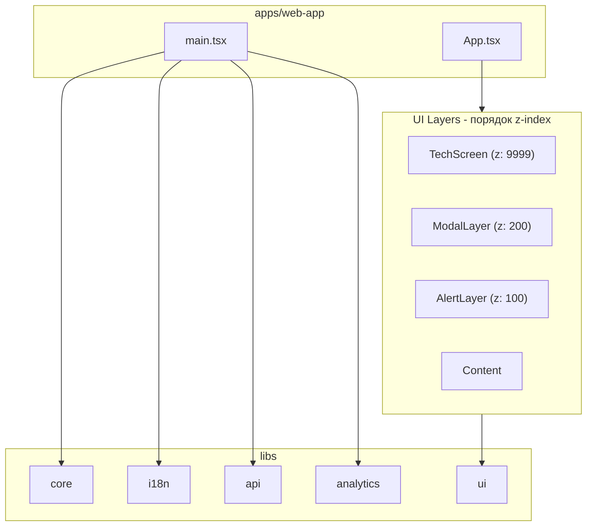
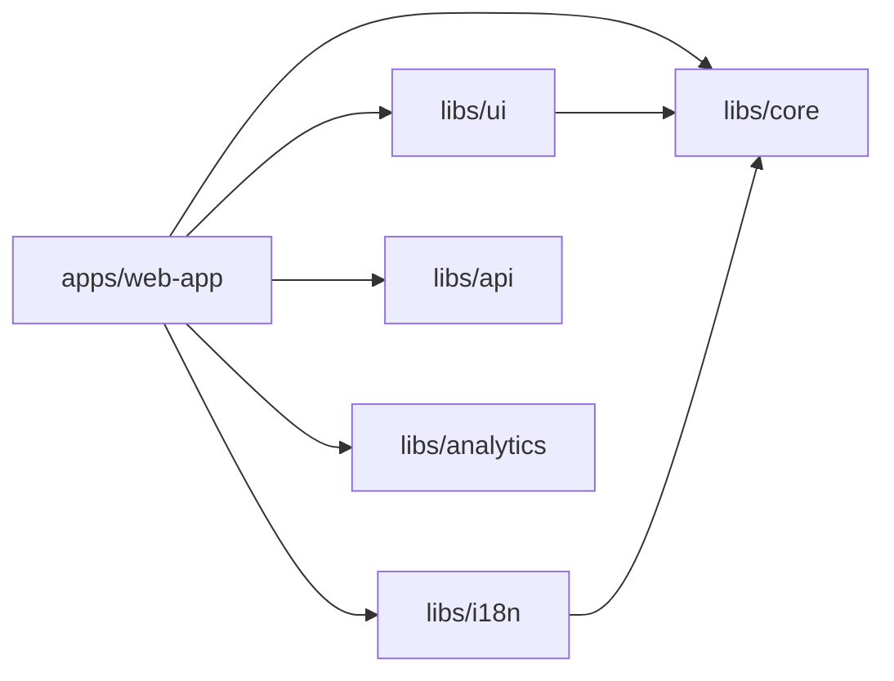

# `apps/web-app` — Архитектура

`web-app` — демонстрационное приложение в Nx-монорепо, построенное как **тонкая оболочка (app shell)** над переиспользуемыми библиотеками.

## Библиотеки

| Библиотека | Назначение |
|------------|------------|
| `@nx-react-architecture/core` | Глобальное состояние (MobX stores), конфигурация, базовые абстракции |
| `@nx-react-architecture/ui` | UI-компоненты (MVVM), слои отображения |
| `@nx-react-architecture/i18n` | Локализация и интернационализация |
| `@nx-react-architecture/api` | HTTP клиент и управление API |
| `@nx-react-architecture/analytics` | Система аналитики с провайдерами |

## Технологии

- **React 18** + `createRoot`
- **MobX** (`configure`, `makeAutoObservable`)
- **mobx-react-lite** (`observer`)
- **MVVM** для компонентов
- **Vite** + Nx plugins
- **CSS Modules**

## Структура проекта

```text
apps/web-app/
  index.html
  vite.config.mts
  src/
    main.tsx                    # Точка входа: инициализация всех систем
    styles.css
    app/
      app.tsx                   # App shell со слоями
      app.module.css
      components/
        DemoPanel/              # Демо-панель с примерами
```

## Архитектура слоёв



## Системы и их использование

### 1. Локализация (i18n)

```tsx
import { useTranslation } from '@nx-react-architecture/i18n';

const MyComponent = () => {
  const { t, locale, setLocale } = useTranslation();

  return (
    <div>
      <h1>{t('welcome.title')}</h1>
      <p>{t('counter.value', { value: 42 })}</p>
      <button onClick={() => setLocale('ru')}>RU</button>
    </div>
  );
};
```

**Добавление переводов**: `libs/i18n/src/locales/ru.json`, `en.json`

### 2. API

```tsx
import { useApi, useApiStore } from '@nx-react-architecture/api';

const MyComponent = () => {
  const api = useApi();
  const apiStore = useApiStore();

  const fetchData = async () => {
    apiStore.setAuthToken('Bearer xxx');
    const users = await api.get<User[]>('/users');
  };
};
```

**Особенности**:
- Интерцепторы запросов/ответов
- Автоматическое добавление auth token
- Отслеживание онлайн-статуса

### 3. Аналитика

```tsx
import { useAnalytics } from '@nx-react-architecture/analytics';

const MyComponent = () => {
  const analytics = useAnalytics();

  const handleClick = () => {
    analytics.track('button_click', { buttonId: 'submit' });
  };

  // Идентификация пользователя
  analytics.identify('user-123', { plan: 'premium' });
};
```

**Провайдеры**: `ConsoleAnalyticsProvider` (для отладки), можно добавить GA, Amplitude и др.

### 4. Прелоадер (загрузка ресурсов)

```tsx
import { usePreloaderStore } from '@nx-react-architecture/core';
import { Preloader } from '@nx-react-architecture/ui';

const App = () => {
  const preloaderStore = usePreloaderStore();

  // Загрузка текстур при старте
  useEffect(() => {
    preloaderStore.loadTextures(['/textures/hero.png', '/textures/bg.png']);
  }, []);

  if (preloaderStore.isLoading) {
    return <Preloader progress={preloaderStore.progress} />;
  }

  return <MainContent />;
};
```

### 5. Технические экраны

```tsx
import { useTechScreenStore } from '@nx-react-architecture/core';

const handleError = () => {
  const techScreenStore = useTechScreenStore();

  // Показать экран техработ
  techScreenStore.showMaintenance('Плановые работы до 18:00');

  // Показать экран обновления
  techScreenStore.showUpdate();

  // Показать экран ошибки с retry
  techScreenStore.showError('Ошибка сети', () => window.location.reload());

  // Скрыть
  techScreenStore.hide();
};
```

### 6. Модальные окна (с приоритетами)

```tsx
import { useModalStore, ModalPriority } from '@nx-react-architecture/core';
import { Modal } from '@nx-react-architecture/ui';

// Компонент модалки
const ConfirmModal = ({ onClose, message }) => (
  <Modal title="Подтверждение" onClose={onClose}>
    <p>{message}</p>
  </Modal>
);

// Использование
const MyComponent = () => {
  const modalStore = useModalStore();

  const openModal = () => {
    modalStore.open({
      id: 'confirm-delete',
      component: ConfirmModal,
      props: { message: 'Удалить элемент?' },
      priority: ModalPriority.HIGH,  // LOW=0, NORMAL=50, HIGH=100, CRITICAL=200
    });
  };

  const closeModal = () => modalStore.close('confirm-delete');
  const closeAll = () => modalStore.closeAll();
};
```

### 7. Алерты (уведомления)

```tsx
import { useAlertStore } from '@nx-react-architecture/core';

const MyComponent = () => {
  const alertStore = useAlertStore();

  // Типы: success, error, warning, info
  alertStore.success('Сохранено!');
  alertStore.error('Ошибка сети', 0);        // 0 = без автоскрытия
  alertStore.warning('Внимание!', 5000);     // 5 секунд
  alertStore.info('Информация');

  // Закрыть конкретный или все
  alertStore.dismiss(alertId);
  alertStore.dismissAll();
};
```

### 8. Реестр компонентов

```tsx
import { useComponentRegistry } from '@nx-react-architecture/core';
import { ManagedComponent } from '@nx-react-architecture/ui';

// Регистрация компонента
const Sidebar = () => (
  <ManagedComponent id="sidebar" applyPosition>
    <nav>...</nav>
  </ManagedComponent>
);

// Управление из другого места
const Controller = () => {
  const registry = useComponentRegistry();

  // Позиционирование
  registry.setPosition('sidebar', { x: 0, y: 100 });

  // Видимость
  registry.setVisible('sidebar', false);
  registry.toggleVisible('sidebar');

  // Получение информации
  const sidebar = registry.getComponent('sidebar');
  console.log(sidebar?.position, sidebar?.visible);
};
```

## Инициализация приложения

```tsx
// main.tsx
import { RootStore, setupMobX, RootStoreProvider } from '@nx-react-architecture/core';
import { I18nStore, I18nProvider } from '@nx-react-architecture/i18n';
import { ApiStore, ApiProvider } from '@nx-react-architecture/api';
import { AnalyticsStore, AnalyticsProvider, ConsoleAnalyticsProvider } from '@nx-react-architecture/analytics';

// 1. Инициализация MobX
setupMobX();

// 2. Создание stores
const rootStore = new RootStore();
const i18nStore = new I18nStore({ defaultLocale: 'ru' });
const apiStore = new ApiStore({ baseUrl: '/api' });
const analyticsStore = new AnalyticsStore({
  providers: [new ConsoleAnalyticsProvider()],
});

// 3. Асинхронная инициализация
await Promise.all([
  rootStore.init(),
  i18nStore.init(),
  analyticsStore.init(),
]);

// 4. Рендер с провайдерами
root.render(
  <RootStoreProvider value={rootStore}>
    <I18nProvider value={i18nStore}>
      <ApiProvider value={apiStore}>
        <AnalyticsProvider value={analyticsStore}>
          <App />
        </AnalyticsProvider>
      </ApiProvider>
    </I18nProvider>
  </RootStoreProvider>
);
```

## Структура App.tsx со слоями

```tsx
export const App = observer(() => {
  const { preloaderStore, techScreenStore } = useRootStore();

  // Прелоадер
  if (preloaderStore.isLoading) {
    return <Preloader progress={preloaderStore.progress} />;
  }

  return (
    <div className={styles.app}>
      {/* Слой 1: Контент */}
      <Header />
      <Main />
      <Footer />

      {/* Слой 2: Алерты (z-index: 100) */}
      <AlertLayer />

      {/* Слой 3: Модалки (z-index: 200) */}
      <ModalLayer />

      {/* Слой 4: Техэкран (z-index: 9999) */}
      {techScreenStore.isActive && <TechScreen {...techScreenStore.config} />}
    </div>
  );
});
```

## Диаграмма зависимостей



## Расширение архитектуры

### Добавление новой фичи

1. **UI компонент** → `libs/ui/src/components/MyFeature/`
2. **ViewModel** (если нужна логика) → `libs/ui/src/components/MyFeature/my-feature.view-model.ts`
3. **Глобальный store** (если нужен) → `libs/core/src/stores/my-feature.store.ts`
4. **Экспорт** → обновить `index.ts` соответствующих библиотек

### Добавление провайдера аналитики

```tsx
// libs/analytics/src/providers/ga.provider.ts
export class GoogleAnalyticsProvider implements AnalyticsProvider {
  name = 'google-analytics';

  track(event: AnalyticsEvent) {
    gtag('event', event.name, event.data);
  }

  identify(identity: UserIdentity) {
    gtag('set', 'user_id', identity.userId);
  }
}
```

### Добавление локали

1. Создать `libs/i18n/src/locales/de.json`
2. Добавить импорт в `i18n.store.ts`
3. Добавить в `bundledLocales` и тип `Locale`

## Переменные окружения

```env
VITE_API_URL=/api
PORT=4000
HOST=localhost
```

## Запуск

```bash
# Разработка
nx serve web-app

# Сборка
nx build web-app
```
