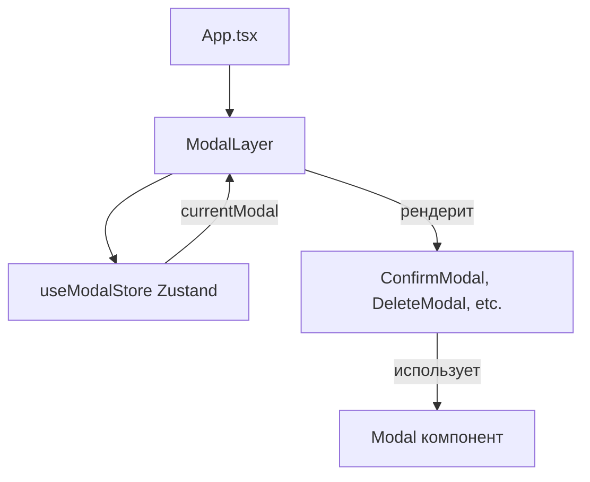

# Система модальных окон — Zustand

## Архитектура

Система построена на **Zustand** для state management вместо MobX, обеспечивая более простую и производительную реализацию.



## 1. **useModalStore** (Zustand Store)

Центральное хранилище состояния всех модалок в приложении на базе Zustand.

### Ключевые особенности:

**Приоритеты модалок:**
```typescript
enum ModalPriority {
  LOW = 0,        // Обычные информационные окна
  NORMAL = 50,    // Стандартный приоритет (по умолчанию)
  HIGH = 100,     // Важные уведомления
  CRITICAL = 200  // Критические действия
}
```

**Типы модальных окон:**
```typescript
enum ModalType {
  CONFIRM = 'confirm',     // Подтверждение действия
  ALERT = 'alert',         // Информационный алерт
  DELETE = 'delete',       // Подтверждение удаления
  EDIT = 'edit',           // Редактирование
  CREATE = 'create',       // Создание
  INFO = 'info',           // Информация
  WARNING = 'warning',     // Предупреждение
  ERROR = 'error',         // Ошибка
  SUCCESS = 'success',     // Успешное действие
  CUSTOM = 'custom',       // Кастомная модалка
}
```

**Структура store:**
```typescript
interface ModalStore {
  // State
  modals: ModalConfig[];
  
  // Computed (getters)
  currentModal: ModalConfig | null;
  hasModals: boolean;
  count: number;
  
  // Actions
  open: (config: ModalConfig) => void;
  close: (id: ModalType | string) => void;
  closeCurrent: () => void;
  closeAll: () => void;
  isOpen: (id: ModalType | string) => boolean;
  handleEscape: () => void;
  handleOverlayClick: () => void;
}
```

### Использование:

```typescript
import { useModalStore, ModalType, ModalPriority } from '@nx-react-architecture/core';

function MyComponent() {
  // Выбираем только нужные части store (оптимизация рендеров)
  const open = useModalStore((state) => state.open);
  const close = useModalStore((state) => state.close);
  const currentModal = useModalStore((state) => state.currentModal);
  
  // Или деструктурируем все сразу (осторожно с перерендерами)
  const { open, close, currentModal } = useModalStore();

  // Открыть модалку со стандартным типом
  const handleOpen = () => {
    open({
      id: ModalType.CONFIRM,          // Стандартный тип из enum
      component: ConfirmModal,         // React компонент
      props: { message: 'Delete?' },  // Props для компонента
      priority: ModalPriority.HIGH,   // Приоритет
      closeOnOverlay: true,           // Закрывать по клику вне
      closeOnEscape: true,            // Закрывать по Escape
      onClose: () => {...}            // Callback после закрытия
    });
  };

  // Или с кастомным ID
  const handleOpenCustom = () => {
    open({
      id: 'my-custom-modal-id',       // Кастомная строка
      component: CustomModal,
      priority: ModalPriority.NORMAL,
    });
  };

  // Закрыть конкретную
  const handleClose = () => close(ModalType.CONFIRM);
}
```

### Логика приоритетов:

```typescript
// В Zustand это вычисляемое свойство (getter)
get currentModal() {
  const { modals } = get();
  if (modals.length === 0) return null;
  
  // Сортировка по приоритету (от большего к меньшему)
  const sorted = [...modals].sort(
    (a, b) => (b.priority ?? 50) - (a.priority ?? 50)
  );
  
  return sorted[0]; // Возвращаем с наивысшим приоритетом
}
```

**Пример работы приоритетов:**
```typescript
// Открыты 3 модалки:
// 1. id: ModalType.INFO, priority: NORMAL (50)
// 2. id: ModalType.WARNING, priority: HIGH (100)
// 3. id: ModalType.ERROR, priority: CRITICAL (200)

// currentModal вернёт ERROR (priority: 200)
// После закрытия ERROR → покажется WARNING (priority: 100)
// После закрытия WARNING → покажется INFO (priority: 50)
```

## 2. **ModalLayer** (Renderer)

React компонент, который рендерит **только одну** (текущую) модалку. Использует селекторы Zustand для оптимизации.

### Принцип работы:

```typescript
export const ModalLayer = () => {
  // Селекторы Zustand - подписка только на нужные части store
  const currentModal = useModalStore((state) => state.currentModal);
  const close = useModalStore((state) => state.close);
  
  if (!currentModal) return null;
  
  const { component: Component, props, id } = currentModal;
  
  const handleClose = () => {
    close(id);
  };
  
  // Рендерим компонент с его props + добавляем onClose
  return <Component {...props} onClose={handleClose} />;
};
```

**Важно:**
- **Нет обёртки `observer`** — Zustand автоматически управляет подписками
- **Селекторы** оптимизируют рендеры — компонент перерендерится только при изменении `currentModal` или `close`
- Передаёт `onClose` колбэк каждой модалке для закрытия

## 3. **Modal** (Base Component)

Базовый UI компонент модального окна (не изменился).

### Функциональность:

**1. Overlay и закрытие:**
```typescript
const handleOverlayClick = (e: React.MouseEvent) => {
  if (closeOnOverlay && e.target === e.currentTarget) {
    onClose();
  }
};
```

**2. Закрытие по Escape:**
```typescript
useEffect(() => {
  const handleKeyDown = (e: KeyboardEvent) => {
    if (e.key === 'Escape') onClose();
  };
  document.addEventListener('keydown', handleKeyDown);
  return () => document.removeEventListener('keydown', handleKeyDown);
}, [onClose]);
```

**3. Блокировка скролла body:**
```typescript
useEffect(() => {
  const originalOverflow = document.body.style.overflow;
  document.body.style.overflow = 'hidden';
  return () => {
    document.body.style.overflow = originalOverflow;
  };
}, []);
```

**4. Размеры:**
- `small` — 400px
- `medium` — 500px (по умолчанию)
- `large` — 700px
- `fullscreen` — на весь экран

## Полный цикл работы

### 1. Инициализация

Zustand store создаётся автоматически при импорте:

```typescript
// libs/core/src/stores/modal.store.ts
export const useModalStore = create<ModalStore>()((set, get) => ({
  modals: [],
  // ... actions
}));
```

**Не требуется** Provider или инициализация в `main.tsx` — store готов к использованию сразу!

### 2. Размещение слоя (App.tsx)
```typescript
<div className={styles.app}>
  <Content />           {/* z-index: auto */}
  <AlertLayer />        {/* z-index: 100 */}
  <ModalLayer />        {/* z-index: 200 */}
  <TechScreen />        {/* z-index: 9999 */}
</div>
```

### 3. Создание своей модалки
```typescript
// Компонент должен принимать onClose
const ConfirmModal = ({ onClose, message }: { onClose: () => void; message?: string }) => {
  return (
    <Modal title="Подтверждение" onClose={onClose}>
      <p>{message}</p>
      <button onClick={onClose}>OK</button>
    </Modal>
  );
};
```

### 4. Открытие модалки
```typescript
import { useModalStore, ModalType, ModalPriority } from '@nx-react-architecture/core';

const MyComponent = () => {
  const open = useModalStore((state) => state.open);
  
  const handleDelete = () => {
    open({
      id: ModalType.DELETE,
      component: ConfirmModal,
      props: { message: 'Удалить элемент?' },
      priority: ModalPriority.HIGH,
    });
  };
  
  return <button onClick={handleDelete}>Delete</button>;
};
```

### 5. Жизненный цикл модалки

```
1. open(config) → добавляет в modals[] через set()
2. currentModal getter → автоматически пересчитывается
3. ModalLayer → Zustand триггерит ререндер через селектор
4. ModalLayer → рендерит Component с props + onClose
5. Пользователь закрывает → вызывается onClose
6. onClose → close(id) → set() удаляет из modals[], вызывает config.onClose
7. currentModal пересчитывается → следующая по приоритету или null
8. ModalLayer → Zustand триггерит ререндер → показывает следующую или null
```

## Преимущества Zustand vs MobX

### ✅ Zustand
- **Простота**: Нет классов, декораторов, observer
- **Размер**: ~1KB vs ~16KB (MobX)
- **API**: Хуки из коробки, привычный для React
- **TypeScript**: Отличная типизация без боли
- **Селекторы**: Встроенная оптимизация рендеров
- **DevTools**: Redux DevTools из коробки
- **Нет провайдеров**: Store доступен глобально

### Сравнение кода

**MobX (было):**
```typescript
export class ModalStore {
  modals: ModalConfig[] = [];
  
  constructor(rootStore: RootStore) {
    this.rootStore = rootStore;
    makeAutoObservable(this, { modals: observable.shallow });
  }
  
  get currentModal() { ... }
  
  open(config) { ... }
}

// В компоненте
const { modalStore } = useRootStore();
const Component = observer(() => {
  modalStore.open({ ... });
});
```

**Zustand (стало):**
```typescript
export const useModalStore = create<ModalStore>()((set, get) => ({
  modals: [],
  
  get currentModal() { ... },
  
  open: (config) => { ... },
}));

// В компоненте (без observer!)
const open = useModalStore((state) => state.open);
open({ ... });
```

## Пример сложного сценария

```typescript
const { open, close } = useModalStore();

// Открываем 3 модалки подряд
open({ 
  id: ModalType.INFO, 
  component: InfoModal, 
  priority: ModalPriority.NORMAL 
});
open({ 
  id: ModalType.WARNING, 
  component: WarningModal, 
  priority: ModalPriority.HIGH 
});
open({ 
  id: ModalType.ERROR, 
  component: ErrorModal, 
  priority: ModalPriority.CRITICAL 
});

// Пользователь видит только ErrorModal (priority: 200)

// Закрываем критическую
close(ModalType.ERROR);
// → Автоматически показывается WarningModal (priority: 100)

// Закрываем warning
close(ModalType.WARNING);
// → Автоматически показывается InfoModal (priority: 50)

// Закрываем info
close(ModalType.INFO);
// → ModalLayer рендерит null
```

## Оптимизация рендеров

### ✅ Хорошо (оптимизировано):
```typescript
// Подписка только на open
const open = useModalStore((state) => state.open);

// Подписка только на currentModal
const currentModal = useModalStore((state) => state.currentModal);
```

### ⚠️ Осторожно (может вызвать лишние рендеры):
```typescript
// Подписка на весь store
const { open, close, modals, currentModal } = useModalStore();
```

### 🎯 Лучшая практика:
```typescript
// Выбирайте только то, что нужно
const Component = () => {
  const currentModal = useModalStore((state) => state.currentModal);
  const hasModals = useModalStore((state) => state.hasModals);
  
  // Для действий можно без селектора (они не меняются)
  const { open, close } = useModalStore();
};
```

## Расположение файлов

- **Store**: `libs/core/src/stores/modal.store.ts` (Zustand)
- **UI Layer**: `libs/ui/src/components/ModalLayer/ModalLayer.tsx`
- **Base Modal**: `libs/ui/src/components/Modal/Modal.tsx`
- **Example Usage**: `apps/web-app/src/app/components/DemoPanel/DemoPanel.tsx`

## API Reference

### useModalStore

| Свойство/Метод | Тип | Описание |
|----------------|-----|----------|
| `modals` | `ModalConfig[]` | Массив всех модалок |
| `currentModal` | `ModalConfig \| null` | Текущая активная (computed) |
| `hasModals` | `boolean` | Есть ли модалки (computed) |
| `count` | `number` | Количество модалок (computed) |
| `open(config)` | `(config: ModalConfig) => void` | Открыть модалку |
| `close(id)` | `(id: ModalType \| string) => void` | Закрыть по ID |
| `closeCurrent()` | `() => void` | Закрыть текущую |
| `closeAll()` | `() => void` | Закрыть все |
| `isOpen(id)` | `(id: ModalType \| string) => boolean` | Проверить открыта ли |
| `handleEscape()` | `() => void` | Обработать Escape |
| `handleOverlayClick()` | `() => void` | Обработать клик на overlay |

### ModalConfig

```typescript
interface ModalConfig<TProps> {
  id: ModalType | string;  // Enum или кастомная строка
  component: ComponentType<TProps & { onClose: () => void }>;
  props?: TProps;
  priority?: ModalPriority;        // Enum: LOW, NORMAL, HIGH, CRITICAL
  closeOnOverlay?: boolean;        // default: true
  closeOnEscape?: boolean;         // default: true
  onClose?: () => void;
}
```

### Modal Props

```typescript
interface ModalProps {
  title?: string;
  children: ReactNode;
  footer?: ReactNode;
  size?: 'small' | 'medium' | 'large' | 'fullscreen';
  onClose: () => void;
  closeOnOverlay?: boolean;
  closeOnEscape?: boolean;
  showCloseButton?: boolean;
  dark?: boolean;
}
```

## Миграция с MobX на Zustand

### Было (MobX):
```typescript
import { observer, useRootStore } from '@nx-react-architecture/core';

const Component = observer(() => {
  const { modalStore } = useRootStore();
  modalStore.open({ ... });
});
```

### Стало (Zustand):
```typescript
import { useModalStore } from '@nx-react-architecture/core';

const Component = () => {  // Без observer!
  const open = useModalStore((state) => state.open);
  open({ ... });
};
```

Система полностью реактивная благодаря Zustand и обеспечивает высокопроизводительное управление модальными окнами любой сложности.
