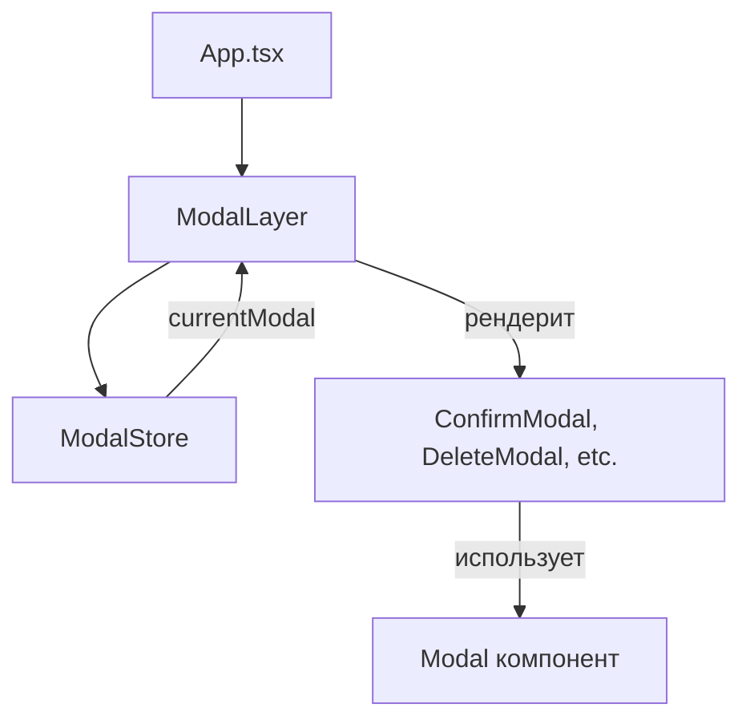

# Система модальных окон — подробное объяснение

## Архитектура

Система состоит из 3 ключевых компонентов:



## 1. **ModalStore** (State Management)

Центральное хранилище состояния всех модалок в приложении.

### Ключевые особенности:

**Приоритеты модалок:**
```typescript
enum ModalPriority {
  LOW = 0,        // Обычные информационные окна
  NORMAL = 50,    // Стандартный приоритет (по умолчанию)
  HIGH = 100,     // Важные уведомления
  CRITICAL = 200  // Критические действия
}
```

**Типы модальных окон:**
```typescript
enum ModalType {
  CONFIRM = 'confirm',     // Подтверждение действия
  ALERT = 'alert',         // Информационный алерт
  DELETE = 'delete',       // Подтверждение удаления
  EDIT = 'edit',           // Редактирование
  CREATE = 'create',       // Создание
  INFO = 'info',           // Информация
  WARNING = 'warning',     // Предупреждение
  ERROR = 'error',         // Ошибка
  SUCCESS = 'success',     // Успешное действие
  CUSTOM = 'custom',       // Кастомная модалка
}
```

**Структура данных:**
- `modals: ModalConfig[]` — очередь всех модалок (массив)
- `currentModal` — **computed getter**, который сортирует по приоритету и возвращает модалку с наивысшим приоритетом
- Использует `observable.shallow` для предотвращения глубокого отслеживания React компонентов

### Основные методы:

```typescript
// Открыть модалку со стандартным типом
modalStore.open({
  id: ModalType.CONFIRM,          // Стандартный тип из enum
  component: ConfirmModal,         // React компонент
  props: { message: 'Delete?' },  // Props для компонента
  priority: ModalPriority.HIGH,   // Приоритет
  closeOnOverlay: true,           // Закрывать по клику вне
  closeOnEscape: true,            // Закрывать по Escape
  onClose: () => {...}            // Callback после закрытия
});

// Или с кастомным ID
modalStore.open({
  id: 'my-custom-modal-id',       // Кастомная строка
  component: CustomModal,
  priority: ModalPriority.NORMAL,
});

// Закрыть конкретную
modalStore.close(ModalType.CONFIRM);

// Закрыть текущую (активную)
modalStore.closeCurrent();

// Закрыть все
modalStore.closeAll();
```

### Логика приоритетов:

```typescript
get currentModal(): ModalConfig | null {
  if (this.modals.length === 0) return null;
  
  // Сортировка по приоритету (от большего к меньшему)
  const sorted = [...this.modals].sort(
    (a, b) => (b.priority ?? 50) - (a.priority ?? 50)
  );
  
  return sorted[0]; // Возвращаем с наивысшим приоритетом
}
```

**Пример работы приоритетов:**
```typescript
// Открыты 3 модалки:
// 1. id: ModalType.INFO, priority: NORMAL (50)
// 2. id: ModalType.WARNING, priority: HIGH (100)
// 3. id: ModalType.ERROR, priority: CRITICAL (200)

// currentModal вернёт ERROR (priority: 200)
// После закрытия ERROR → покажется WARNING (priority: 100)
// После закрытия WARNING → покажется INFO (priority: 50)
```

## 2. **ModalLayer** (Renderer)

React компонент, который рендерит **только одну** (текущую) модалку.

### Принцип работы:

```typescript
export const ModalLayer = observer(() => {
  const modalStore = useModalStore();
  const current = modalStore.currentModal; // Реактивно следит за изменениями
  
  if (!current) return null; // Нет модалок → ничего не рендерим
  
  const { component: Component, props, id } = current;
  
  const handleClose = () => {
    modalStore.close(id);
  };
  
  // Рендерим компонент с его props + добавляем onClose
  return <Component {...props} onClose={handleClose} />;
});
```

**Важно:**
- `observer` делает компонент реактивным — автоматически перерендеривается при изменении `currentModal`
- Передаёт `onClose` колбэк каждой модалке для закрытия

## 3. **Modal** (Base Component)

Базовый UI компонент модального окна с общим функционалом.

### Функциональность:

**1. Overlay и закрытие:**
```typescript
const handleOverlayClick = (e: React.MouseEvent) => {
  if (closeOnOverlay && e.target === e.currentTarget) {
    onClose();
  }
};
```

**2. Закрытие по Escape:**
```typescript
useEffect(() => {
  const handleKeyDown = (e: KeyboardEvent) => {
    if (e.key === 'Escape') onClose();
  };
  document.addEventListener('keydown', handleKeyDown);
  return () => document.removeEventListener('keydown', handleKeyDown);
}, [onClose]);
```

**3. Блокировка скролла body:**
```typescript
useEffect(() => {
  const originalOverflow = document.body.style.overflow;
  document.body.style.overflow = 'hidden';
  return () => {
    document.body.style.overflow = originalOverflow;
  };
}, []);
```

**4. Размеры:**
- `small` — 400px
- `medium` — 500px (по умолчанию)
- `large` — 700px
- `fullscreen` — на весь экран

## Полный цикл работы

### 1. Инициализация (main.tsx)
```typescript
const rootStore = new RootStore(); // Содержит modalStore
<RootStoreProvider value={rootStore}>
  <App />
</RootStoreProvider>
```

### 2. Размещение слоя (App.tsx)
```typescript
<div className={styles.app}>
  <Content />           {/* z-index: auto */}
  <AlertLayer />        {/* z-index: 100 */}
  <ModalLayer />        {/* z-index: 200 */}
  <TechScreen />        {/* z-index: 9999 */}
</div>
```

### 3. Создание своей модалки
```typescript
// Компонент должен принимать onClose
const ConfirmModal = observer<{ onClose: () => void; message?: string }>(
  ({ onClose, message }) => {
    return (
      <Modal title="Подтверждение" onClose={onClose}>
        <p>{message}</p>
        <button onClick={onClose}>OK</button>
      </Modal>
    );
  }
);
```

### 4. Открытие модалки
```typescript
const MyComponent = () => {
  const { modalStore } = useRootStore();
  
  const handleDelete = () => {
    modalStore.open({
      id: ModalType.DELETE,  // Используем enum для стандартных типов
      component: ConfirmModal,
      props: { message: 'Удалить элемент?' },
      priority: ModalPriority.HIGH,
    });
  };
};
```

### 5. Жизненный цикл модалки

```
1. modalStore.open() → добавляет в modals[]
2. currentModal getter → вычисляет модалку с max приоритетом
3. ModalLayer (observer) → автоматически перерендеривается
4. ModalLayer → рендерит Component с props + onClose
5. Пользователь закрывает → вызывается onClose
6. onClose → modalStore.close(id)
7. close() → удаляет из modals[], вызывает config.onClose
8. currentModal пересчитывается → следующая по приоритету или null
9. ModalLayer перерендеривается → показывает следующую или null
```

## Преимущества архитектуры

1. **Decoupled state** — состояние модалок отделено от UI
2. **Приоритеты** — автоматическое управление важностью
3. **Очередь** — можно открыть несколько, показывается важнейшая
4. **Type-safe** — TypeScript обеспечивает типобезопасность props
5. **Переиспользуемость** — любой компонент может открыть модалку
6. **Централизованное управление** — один store для всех модалок

## Пример сложного сценария

```typescript
// Открываем 3 модалки подряд
modalStore.open({ 
  id: ModalType.INFO, 
  component: InfoModal, 
  priority: ModalPriority.NORMAL 
});
modalStore.open({ 
  id: ModalType.WARNING, 
  component: WarningModal, 
  priority: ModalPriority.HIGH 
});
modalStore.open({ 
  id: ModalType.ERROR, 
  component: ErrorModal, 
  priority: ModalPriority.CRITICAL 
});

// Пользователь видит только ErrorModal (priority: 200)

// Закрываем критическую
modalStore.close(ModalType.ERROR);
// → Автоматически показывается WarningModal (priority: 100)

// Закрываем warning
modalStore.close(ModalType.WARNING);
// → Автоматически показывается InfoModal (priority: 50)

// Закрываем info
modalStore.close(ModalType.INFO);
// → ModalLayer рендерит null
```

## Расположение файлов

- **Store**: `libs/core/src/stores/modal.store.ts`
- **UI Layer**: `libs/ui/src/components/ModalLayer/ModalLayer.tsx`
- **Base Modal**: `libs/ui/src/components/Modal/Modal.tsx`
- **Example Usage**: `apps/web-app/src/app/components/DemoPanel/DemoPanel.tsx`

## API Reference

### ModalStore

| Метод | Параметры | Описание |
|-------|-----------|----------|
| `open<T>(config)` | `ModalConfig<T>` | Открыть модалку |
| `close(id)` | `ModalType \| string` | Закрыть по ID |
| `closeCurrent()` | - | Закрыть текущую |
| `closeAll()` | - | Закрыть все |
| `isOpen(id)` | `ModalType \| string` | Проверить открыта ли |
| `handleEscape()` | - | Обработать Escape |
| `handleOverlayClick()` | - | Обработать клик на overlay |

### ModalConfig

```typescript
interface ModalConfig<TProps> {
  id: ModalType | string;  // Enum или кастомная строка
  component: ComponentType<TProps & { onClose: () => void }>;
  props?: TProps;
  priority?: ModalPriority;        // Enum: LOW, NORMAL, HIGH, CRITICAL
  closeOnOverlay?: boolean;        // default: true
  closeOnEscape?: boolean;         // default: true
  onClose?: () => void;
}
```

### Modal Props

```typescript
interface ModalProps {
  title?: string;
  children: ReactNode;
  footer?: ReactNode;
  size?: 'small' | 'medium' | 'large' | 'fullscreen';
  onClose: () => void;
  closeOnOverlay?: boolean;
  closeOnEscape?: boolean;
  showCloseButton?: boolean;
  dark?: boolean;
}
```

Система полностью реактивная благодаря MobX и обеспечивает плавное управление модальными окнами любой сложности.
